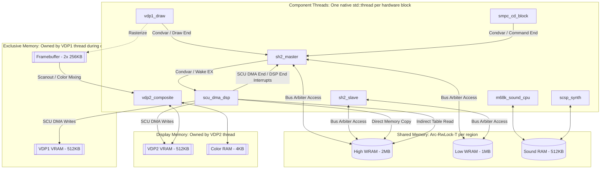
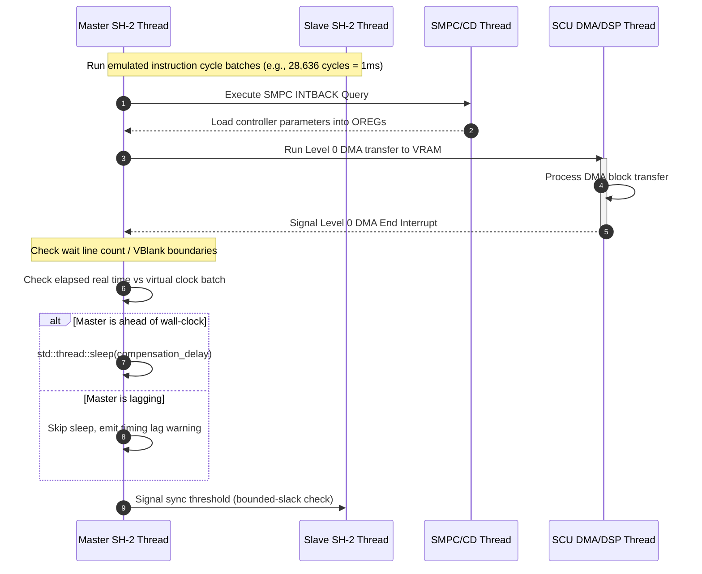
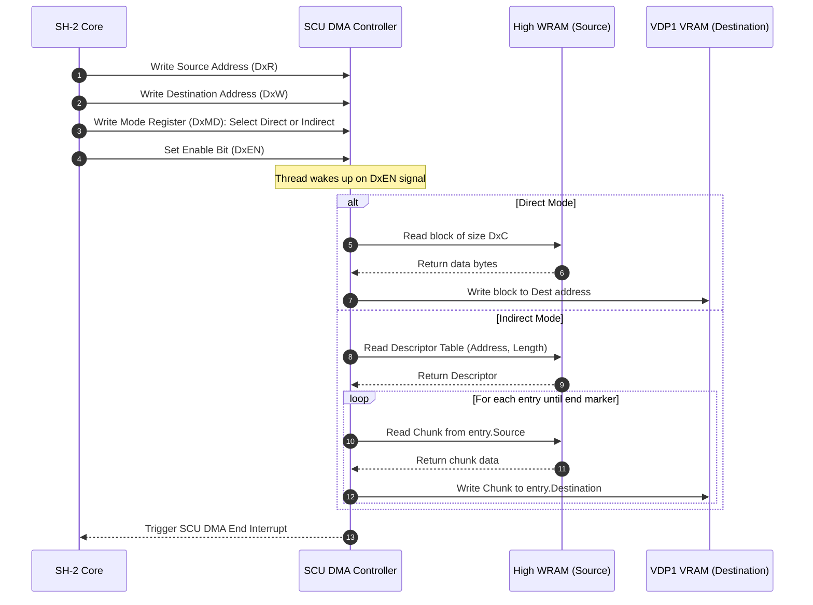
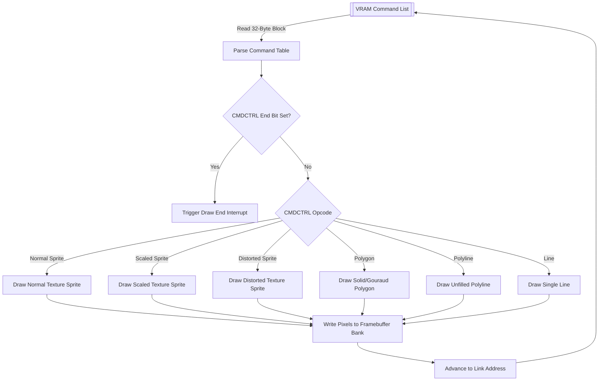
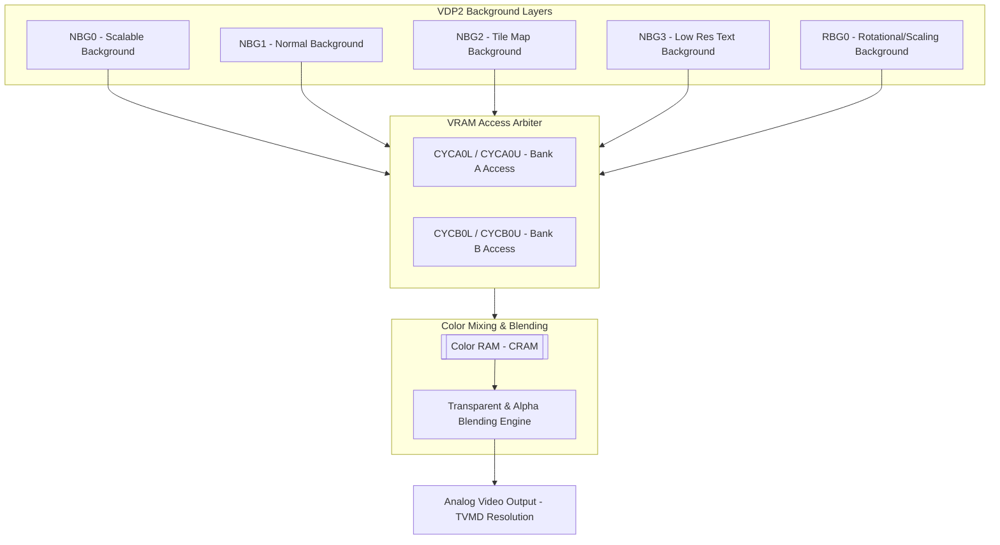
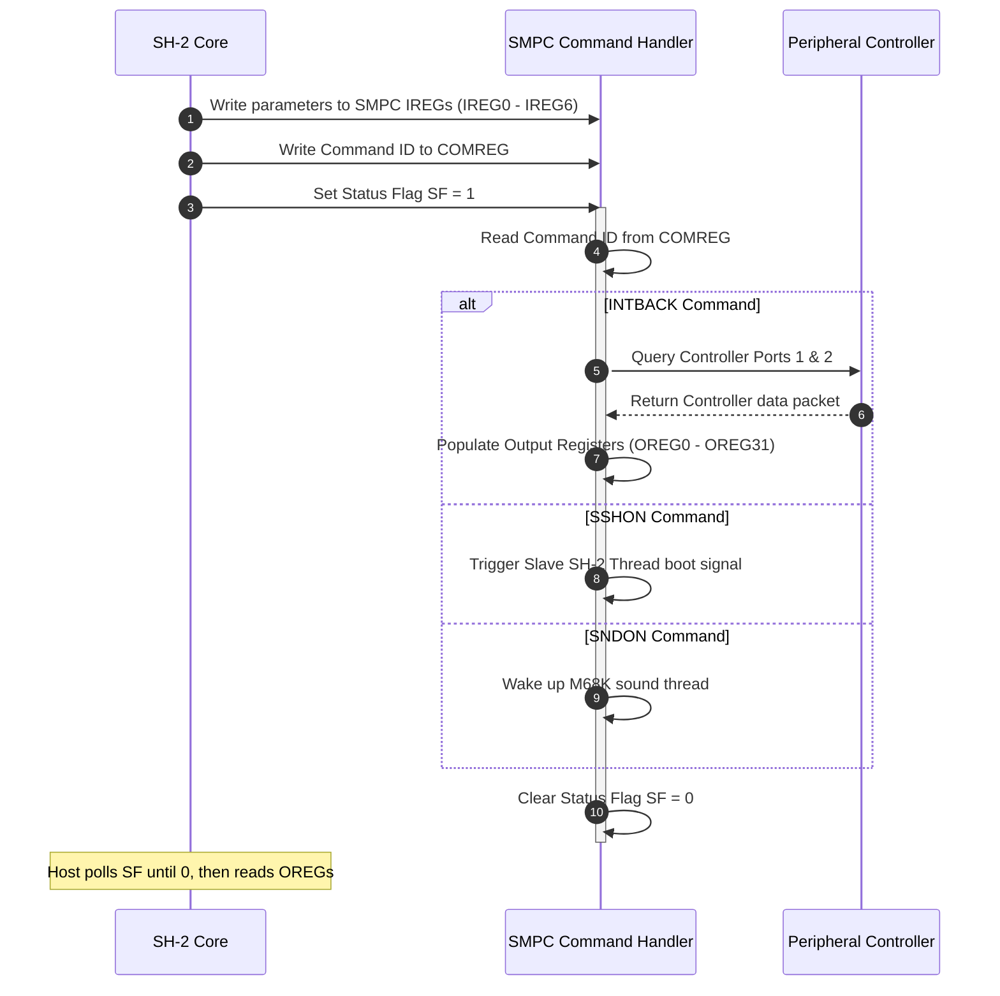
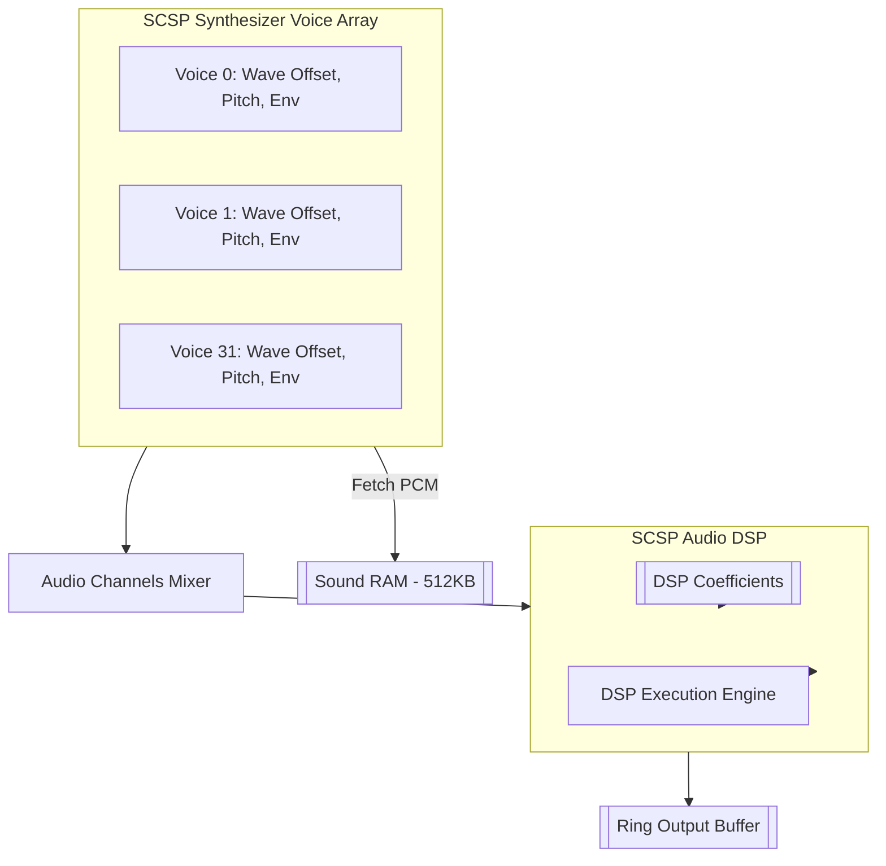

# Mimas Sega Saturn Emulator - Low-Level Engineering Specification (V2)

This document is Mimas's own engineering design: thread topology, memory ownership, synchronization mechanics, and pacing. **It is not a Saturn hardware reference** — for exact register/opcode/DMA/interrupt facts about the real hardware, see `docs/hardware-reference/` (one file per subsystem, every claim cited to `yabause/src/<file>:<line>`). This document used to duplicate a lot of that detail at a shallower, occasionally wrong level of precision (stale/incorrect addresses, an invented pseudo-Rust snippet that had accidentally cross-contaminated a Dreamcast SH-4 type into an SH-2 doc); that duplication has been removed in favor of pointers, since a second, less-precise copy of the same facts is a liability, not a convenience.

Several diagrams below describe **target design**, not current implementation status — each section says explicitly where the two diverge. For the concrete plan closing each gap, see `docs/implementation-plans/<subsystem>.md`.

---

## 1. System Concurrency Architecture

The emulated Sega Saturn architecture is partitioned into native OS threads (`std::thread`), with each thread representing a distinct piece of silicon on the physical Saturn board. Memory regions are segregated by ownership; shared ranges use region-granular `Arc<RwLock<T>>` boundaries to prevent global lock contention.

### 1.1 Diagram: Concurrency, Memory Ownership, and Inter-Thread Buses (target design)

**Where the current code diverges from this diagram** (see `CLAUDE.md`'s "Known architecture debt" for the authoritative list, kept there rather than duplicated here so it doesn't go stale in two places):
- VDP1 command execution runs on the `vdp2_composite` thread, not `vdp1_draw` (which is currently idle).
- There is no independent SCU DMA controller yet — only the SCU DSP's own 2-of-8 DMA addressing modes exist, on the `scu_dma_dsp` thread.
- The SMPC/CD-block thread runs no logic at all; the (partial) SMPC command handling that does exist is inline in `Sh2`'s own memory read/write handlers on the SH-2 master thread, not a separate cross-thread handshake as drawn.
- Interrupt delivery for VBLANK exists (a plain flag `Sh2` polls once per `step()`); the `Condvar`-based signaling drawn above for SCU DSP-end/Draw-end/SMPC-command-end does not exist as such — see each subsystem's implementation plan.

---

### 1.2 Memory Mappings & Memory Regions

Real physical addresses and sizes, cross-checked against `docs/hardware-reference/memory-bus.md` (which in turn cites `yabause/src/memory.c` line-by-line):

* **High Work RAM (HWRAM)**: 2,097,152 bytes (2MB), real range `0x06000000`-`0x061FFFFF`, mirrored across the wider `0x06000000`-`0x07FFFFFF` window. Implemented today (`shared_buffers.rs`) as 32 independent 64KB-striped `RwLock`s, not a single lock over the region — see §1.3.
* **Low Work RAM (LWRAM)**: 1,048,576 bytes (1MB), mapped at `0x00200000`-`0x002FFFFF`.
* **Sound RAM (SNDRAM)**: 524,288 bytes (512KB), mapped at `0x05A00000`-`0x05AFFFFF`. One `RwLock<Box<[u8; 0x80000]>>`, shared between the M68K thread and the (currently basic) SCSP synthesis step.
* **VDP1 VRAM**: 524,288 bytes (512KB), mapped at `0x05C00000`-`0x05C7FFFF`.
* **VDP1 Framebuffer**: real hardware double-buffers this (two 256KB banks); the current implementation models it as **one flat 512KB window** (`shared_buffers.rs`'s explicit comment on this), not yet the two-bank swap described in the diagram above. See `docs/implementation-plans/vdp1.md`.
* **VDP2 VRAM**: 524,288 bytes (512KB), mapped at `0x05E00000`-`0x05E7FFFF`.

---

### 1.3 Mitigating Bus Contention on High WRAM

**The Problem**: The Master SH-2 and Slave SH-2 execute instructions at 28.6 MHz. If both cores access High WRAM concurrently while the SCU DMA runs high-speed bursts (e.g., Level 0 DMA copying textures to VDP1 VRAM), a single global lock over High WRAM would cause thread contention between accesses that have nothing to do with each other.

**The approach taken**:
1. **Lock striping**: The 2MB High WRAM is divided into 32 independent 64KB-striped `RwLock`s (`WorkRam::high_ram` in `shared_buffers.rs`). Parallel reads/writes to disjoint address spaces don't block one another. This part is implemented, not aspirational.
2. **Instruction caching bypassing the lock**: real SH-2 hardware has a 4KB cache whose hits wouldn't need to touch the shared bus at all. **Not yet implemented** — `sh2.rs` has no cache model today; see `docs/hardware-reference/sh2-cpu.md`'s cache section and `docs/implementation-plans/sh2-cpu.md` for what adding one would take, and whether it's worth the complexity for correctness-first work versus purely as a contention optimization.
3. **Lockless DMA write queues**: a possible future optimization for high-throughput SCU DMA bursts, not implemented — the SCU's own DMA controller doesn't exist yet at all (see `docs/implementation-plans/scu.md`), so this is speculative until that lands.

---

## 2. SH-2 Processor Execution Loop and Throttling

The Sega Saturn employs two Hitachi SH-2 cores running at 28.6 MHz (`SH2_CLOCK_HZ` in `saturn-core/src/throttle.rs`, cross-checked against Yabause's exact timing constant — see that file's doc comment).

### 2.1 Diagram: Frame-Pacing & Sync (target design)

The actual pacing mechanism (`ClockThrottle` in `throttle.rs`) is implemented and tested, but as **batched wall-clock pacing per clock domain**, not the cross-thread SMPC/SCU message-passing drawn above — see `throttle.rs`'s own doc comments for the real, current mechanism, and `sync.rs`'s `LockStepSync` for the bounded-slack mechanism (also implemented, see `CLAUDE.md`). The INTBACK/SCU-DMA steps in this diagram describe the target request/response *shape*; today's INTBACK and SCU DSP execution both happen synchronously within a single thread's step, not as the message round-trip drawn here.

### 2.2 Gotcha: Delay Slots and Divider Division Step Execution

Both of these are implemented in `sh2.rs` today, cross-checked opcode-by-opcode against `yabause/src/sh2int.c` — see `docs/hardware-reference/sh2-cpu.md` for the exact, verified semantics (delay-slot ordering, illegal-slot-instruction conditions, the full `DIV1` step algorithm including flag updates) rather than reproducing a second copy of that logic here. `CLAUDE.md`'s testing philosophy note (`bt_bf_no_delay_slot`, the first `DIV1` test) explains why an independently-derived test value matters more than a plausible-looking reference implementation.

---

## 3. SCU DMA and DSP Co-Processor

The System Control Unit (SCU) manages inter-component DMA transfers and executes fast coordinate math via its internal DSP. Full register map, DMA addressing-mode table, and DSP instruction encoding: `docs/hardware-reference/scu.md`.

**Current implementation status**: the SCU DSP interpreter (`saturn-core/src/scu_dsp.rs`) implements the full ALU/operation/load-immediate/jump/loop/end instruction groups and 2 of the real hardware's 8 DMA addressing-mode variants (the two the traced real BIOS program actually uses — see that file's module doc comment and `.development/current_blocker.md`'s history). **The SCU's own independent DMA controller (3 priority levels, direct/indirect mode, address-increment select) does not exist as a separate thing** — `saturn-core/src/scu.rs`'s `Scu` struct is dead code, referenced only by unit tests, never constructed by `SaturnSystem`. See `docs/implementation-plans/scu.md` for the concrete plan to build a real DMA controller and reconcile it with `scu_dsp.rs`.

### 3.1 Diagram: SCU DMA Ingestion Pipeline (target design, not yet implemented)

---

## 4. VDP1 Drawing Engine & Rasterization

VDP1 is the geometry co-processor, processing Command Tables from VDP1 VRAM. Full register map and command-table field layout (all draw command types, color modes, clipping): `docs/hardware-reference/vdp1.md`.

**Current implementation status**: `saturn-core/src/vdp.rs`'s `execute_vdp1` implements **only the Polygon/Quad command**, as a flat-fill (no texture read, no gouraud, no clipping), and is invoked from the `vdp2_composite` thread rather than a dedicated VDP1 thread (see §1.1's divergence note). No draw-end interrupt is signaled. See `docs/implementation-plans/vdp1.md` for the remaining command types and the plan to give VDP1 its own real thread/timing.

### 4.1 Diagram: VDP1 Command List Processing Pipeline (target design — only the Polygon path exists today)

---

## 5. VDP2 Display Engine, Planes, and Cycle Patterns

VDP2 handles background layering, scaling, screen blending, and color palette operations. Full register map (TVMD/RAMCTL/CYCA/CYCB/BGON/rotation parameters/windows/color calc) and the exact rendering algorithm per pixel format: `docs/hardware-reference/vdp2.md`.

**Current implementation status**: `render_backdrop` in `vdp.rs` decodes `TVMD` for resolution and display-enable, fills the frame with the `BKTAL` backdrop color, and overlays VDP1's framebuffer treating a zero pixel as transparent. **No NBG0-3 tile/bitmap layers, no RBG rotation layers, no cycle-pattern VRAM scheduling, no priority/color-calc compositing, no CRAM palette lookups, and no windows exist yet.** See `docs/implementation-plans/vdp2.md` — this is the single largest remaining gap of any subsystem in Mimas.

### 5.1 Layer Compositing and Mixing Pipeline (target design — none of this exists yet beyond the flat backdrop)

---

## 6. SMPC & CD-ROM Command Protocols

The System Manager and Peripheral Control (SMPC) manages system boots, resets, region configuration, and peripheral scanning. Full register map, every command's handshake, and the INTBACK peripheral-polling byte format: `docs/hardware-reference/smpc-peripheral.md`.

**Current implementation status**: `Sh2`'s memory write handler arms the command (`Smpc::arm_command`, sets `SF = 1`) and computes when it's really due from Master's own executed cycles (`Sh2::arm_smpc_wake`) -- Master's `step()` marks it `Smpc::dispatch_ready` and wakes Core 7 only once that real delay has actually elapsed, and Core 7 dispatches it (`Smpc::execute_expired_command`) with no timer of its own. Peripheral report shapes exist for every single-peripheral-per-port type (`PeripheralState`: pad, wheel, mission stick, 3D pad, twin sticks, mouse, keyboard, a gun's status-only presence) and the INTBACK/PDR/DDR paths that expose them, but live input plumbing only reaches player 1's digital pad (via `mimas_window.rs`'s keyboard mapping) -- multi-tap and any other live input source (analog axes, mouse motion, a second pad) remain unwired. See `docs/implementation-plans/smpc-peripheral.md`.

### 6.1 Diagram: SMPC Command Handshake (implemented via cross-thread arming to Core 7)

---

## 7. SCSP and Sound Subsystem

The sound subsystem comprises a Motorola 68000 CPU, 512KB Sound RAM, and the Sega Custom Sound Processor (SCSP). Full register map (32 voice slots, envelope generator, LFO, sound DSP): `docs/hardware-reference/scsp.md`.

**Current implementation status**: `saturn-core/src/scsp.rs`'s `Scsp::synthesize` **is** wired live (called every loop iteration on the `scsp_synth` thread), and does basic per-voice PCM playback from real register reads (start address, loop points, pitch, level) — but implements no envelope generator, no LFO, and no sound DSP. `saturn-core/src/m68k.rs` (the sound CPU interpreter) is a separate, generic from-scratch 68000 core, already wired to gate on/off via SMPC's SNDON/SNDOFF. See `docs/implementation-plans/scsp.md` for exactly which register-layout assumptions in the current code need re-verifying against `hardware-reference/scsp.md` before building the envelope/LFO/DSP on top of them.

### 7.1 Diagram: Audio Output Generation (target design — voice playback exists; DSP and full envelope/LFO do not)

---

## 8. CD Block / CS2 Subsystem

The CD block controller operates as an autonomous processor communicating via `CR1`-`CR4` and `HIRQ`. Full register map and every command's protocol: `docs/hardware-reference/cs2-cdblock.md`.

**Current implementation status**: `saturn-core/src/cdrom.rs`'s `Cdrom` correctly reads real CHD sectors (hunk-size detection, hunk caching), but **is not integrated into the emulated system at all** — nothing wires it to the memory-mapped `cs2_regs` block (a plain read/write stub, see `shared_buffers.rs`) or to any thread; it's only ever invoked directly from `saturn-frontend-native`'s `main()` as a one-shot demo read. The entire `CR1`-`CR4`/`HIRQ` command protocol layer does not exist yet. See `docs/implementation-plans/cs2-cdblock.md`.
