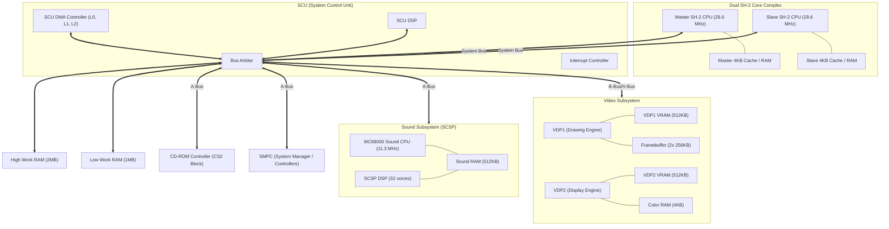

# Sega Saturn Architecture — Overview & Index

This document used to attempt a full hardware reference manual (register maps, opcode tables, DMA/command protocols) derived from the Yabause codebase. That attempt was necessarily shallow — it named registers and gave rough bit-layouts without exhaustively covering every field, and some of its detail turned out imprecise (e.g. address-notation inconsistencies, an incomplete opcode table) once checked closely.

**That job has since been done properly, exhaustively, in `docs/hardware-reference/`** — one file per subsystem, every register/opcode/DMA-mode/command sourced *exclusively* from reading Yabause's C/C++ source directly, with a `yabause/src/<file>:<line>` citation on every claim so it's independently verifiable, plus a closing "known deviations" section per file cataloging real bugs/hacks/dead code found in Yabause along the way (not invented — verified against the source). Go there for exact hardware facts:

| Subsystem | Reference |
|---|---|
| Dual SH-2 CPU cores, on-chip peripherals, cache | [`hardware-reference/sh2-cpu.md`](hardware-reference/sh2-cpu.md) |
| System memory map, cache-through addressing, A-Bus CS0/CS1 cartridge | [`hardware-reference/memory-bus.md`](hardware-reference/memory-bus.md) |
| SCU: DMA controller, DSP co-processor, interrupt controller, timers | [`hardware-reference/scu.md`](hardware-reference/scu.md) |
| SMPC command protocol, INTBACK, peripheral/controller protocol | [`hardware-reference/smpc-peripheral.md`](hardware-reference/smpc-peripheral.md) |
| VDP1: registers, command table format, every draw command type | [`hardware-reference/vdp1.md`](hardware-reference/vdp1.md) |
| VDP2: ~100 registers, NBG/RBG layers, cycle patterns, color calc | [`hardware-reference/vdp2.md`](hardware-reference/vdp2.md) |
| SCSP: 32 voice slots, envelope/LFO, sound DSP, sound RAM DMA | [`hardware-reference/scsp.md`](hardware-reference/scsp.md) |
| CD block / CS2: CR1-4/HIRQ protocol, every CD command, disc image format | [`hardware-reference/cs2-cdblock.md`](hardware-reference/cs2-cdblock.md) |

For where Mimas's *current Rust implementation* stands relative to each of these, and the concrete plan to close the gap, see `docs/implementation-plans/<subsystem>.md`. For Mimas's own architecture (thread model, memory ownership, synchronization — as opposed to Saturn hardware facts), see `mimas-architecture-spec.md` and `mimas_emu_engineering_draft.md`.

---

## System Block Diagram & Bus Topology

Kept here as a single-page mental model of how the major components connect — a simplified overview, not authoritative on exact bus widths or addresses (defer to `hardware-reference/memory-bus.md` for those).

