# Registro da sessão: arquiteturas de hardware, Saturn e emulação em Rust

Este documento reúne todas as perguntas feitas na sessão, o contexto de cada uma, minhas respostas, e os diagramas gerados — recriados aqui em **Mermaid.js** (estático) no lugar das versões animadas em SVG mostradas no chat.

---

## 1. Diagrama da arquitetura x86: programa → CPU → caches → memória/GPU

**Pergunta:** pedido de um diagrama animado mostrando informações saindo de um programa, passando pela CPU, guardadas em cache L1/L2, e conversando com a memória (via FSB e slots DDR) e com a GPU (via FSB/PCI Express) — uma ilustração da arquitetura x86, barramentos e caches.

**Resposta:** expliquei o caminho: o programa é executado pelo núcleo (ALU); dados de uso frequente ficam em L1 (pequena, rapidíssima) e L2 (maior); quando não estão em cache, saem pelo Front Side Bus (FSB) até a RAM (via slots DDR) ou até a GPU (via PCI Express). Observei que esse desenho reflete a arquitetura x86 clássica (anos 2000); em CPUs modernas o FSB foi substituído por um controlador de memória integrado e por interconexões diretas (QPI/Infinity Fabric).

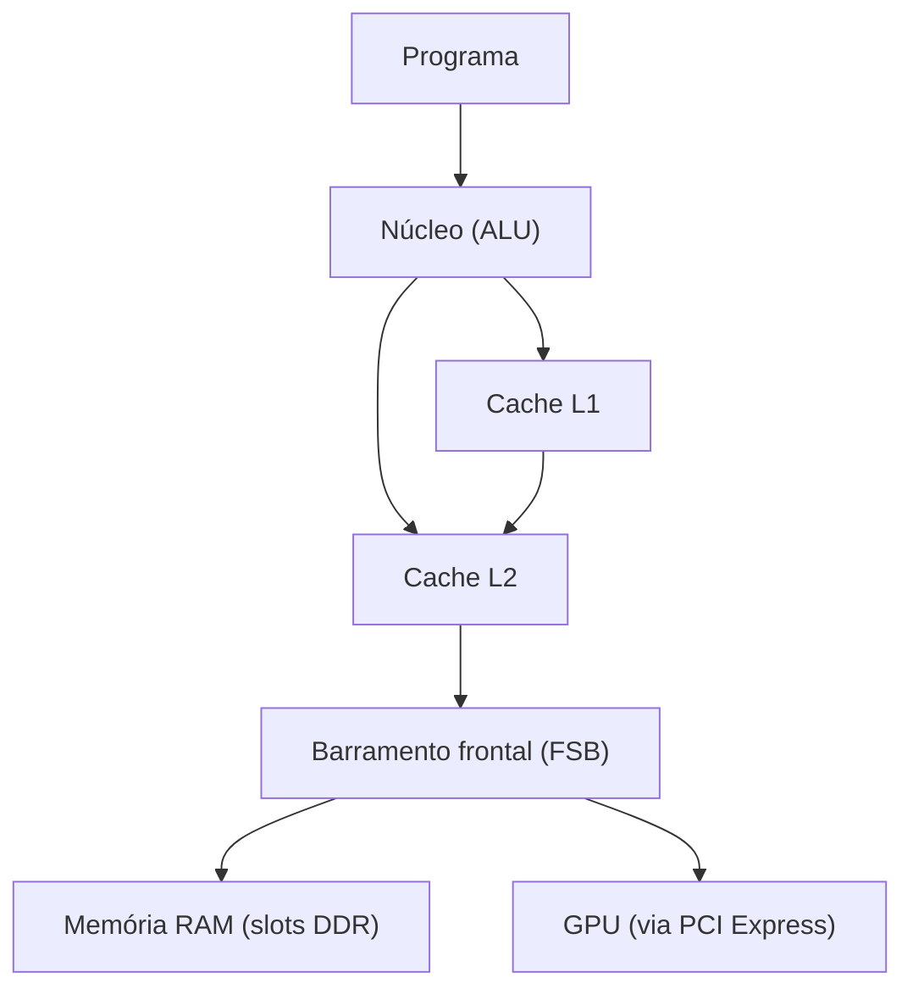

---

## 2. Do input do jogo até o frame na tela

**Pergunta:** "crie algo mais completo, desde o input de um jogo até sair o frame na tela".

**Resposta:** dividi em duas partes. Parte 1 — o comando do jogador vai do periférico ao USB, a CPU processa a lógica do jogo (física, IA, próximo estado) e envia comandos de desenho à GPU via PCI Express. Parte 2 — dentro da GPU, o vertex shader posiciona os vértices, a rasterização converte triângulos em pixels, o pixel shader calcula a cor final; o frame pronto fica no framebuffer (VRAM) e sai por HDMI/DisplayPort até o monitor.

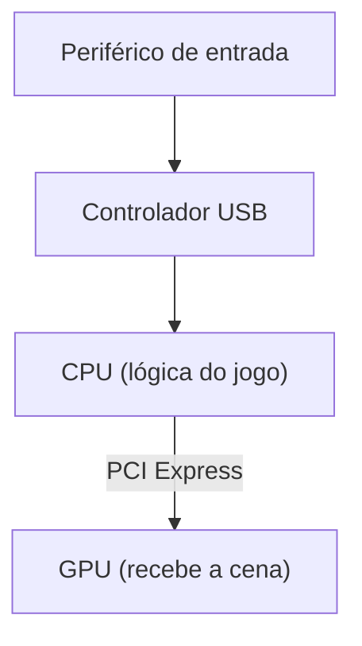

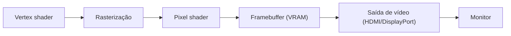

---

## 3. Passeio físico pelo hardware (placa-mãe, barramentos e caches CPU vs. GPU)

**Pergunta:** pedido para ver o "passeio" no hardware físico — CPU, GPU, memória DDR, disco, periféricos, monitor — com mais detalhes de FSB, caches de GPU e CPU, PCI Express e outros barramentos.

**Resposta:** mostrei o mapa físico de como os componentes se conectam (RAM ↔ CPU via canal DDR; CPU ↔ GPU via PCIe; CPU ↔ Chipset via DMI, sucessor do FSB; Chipset ↔ Disco via SATA/NVMe; Chipset ↔ Periféricos via USB; GPU → Monitor via HDMI/DP). Depois comparei a hierarquia de caches: CPU tem poucos núcleos fortes com L1 minúscula e rapidíssima, L2/L3 compartilhada, e RAM; GPU tem milhares de núcleos simples, cache L1 por bloco de shaders, L2 compartilhada, e VRAM dedicada para texturas.

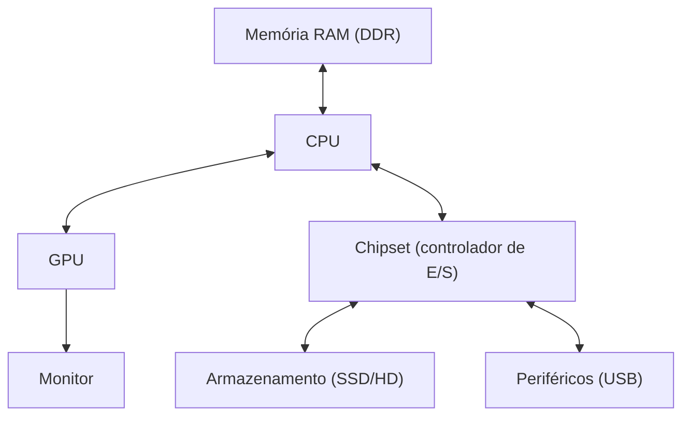

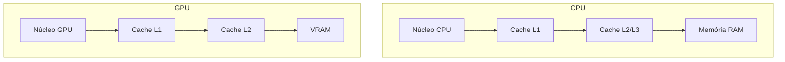

---

## 4. Arquitetura do Sega Saturn (a partir do relatório enviado)

**Pergunta:** pedido para desenhar a estrutura de hardware descrita no arquivo `saturn_architecture_report.md`, incluindo DMAs, VLIWs, registradores e buffers.

**Resposta:** dividi em três diagramas. (1) Topologia geral: a SCU como hub central conectando o bloco CPU (SH-2 mestre/escravo), o bloco de vídeo (VDP1/VDP2), o bloco de som (68000/SCSP) e periféricos (SMPC/CS2). (2) Interior da SCU: três canais de DMA com prioridades diferentes (nível 0 acordado pelo V-Blank para o VDP1, nível 1 por H-Blank/CD-ROM, nível 2 de baixa prioridade) e o DSP VLIW com Program RAM (256 instruções) e Data RAM em 4 blocos (MD0–MD3). (3) Pipeline de CD-ROM: registradores CR1–CR4 e HIRQ, 24 filtros/seletores de setor, buffer de partição (até 200 blocos), porta de dados DTR, e a transferência final via DMA da SCU até a Work RAM.

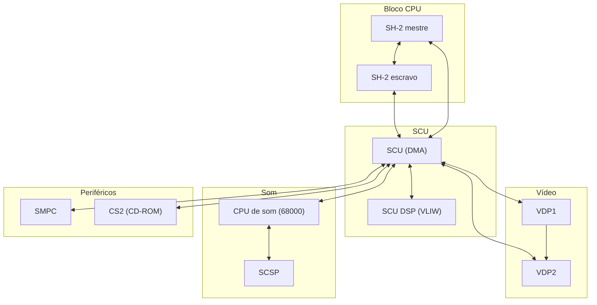

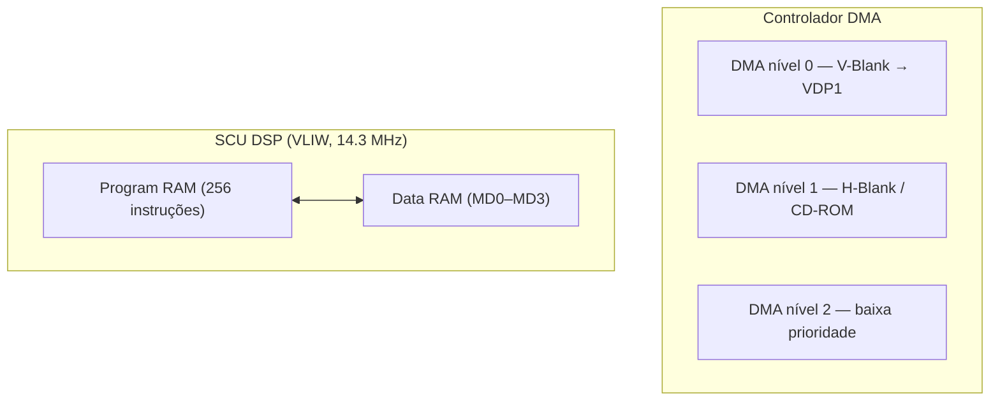

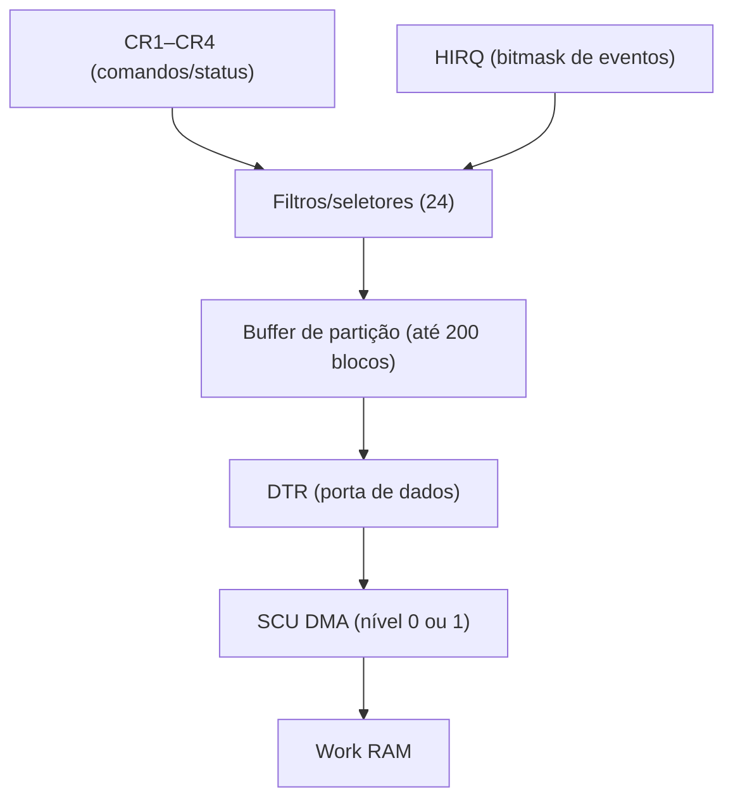

---

## 5. O que o SCU DSP faz e o que é VLIW

**Pergunta:** explicação sobre a função do SCU DSP e o conceito de VLIW.

**Resposta:** o SCU DSP é um processador extra dentro da SCU, dedicado a cálculos pesados (transformações 3D, física, listas de desenho) sem ocupar o SH-2 principal — roda a 14.3 MHz, com Program RAM de 256 instruções e Data RAM em 4 blocos, registradores próprios (`AC`, `P`, `RX`, `RY`), e famílias de instruções para ALU, carregamento de constantes e controle (DMA, saltos, loops). VLIW (*Very Long Instruction Word*) significa que uma única instrução é dividida em campos que controlam várias unidades de hardware **simultaneamente**, decidido antecipadamente por quem escreve o código — diferente de uma CPU comum, que executa uma operação por vez.

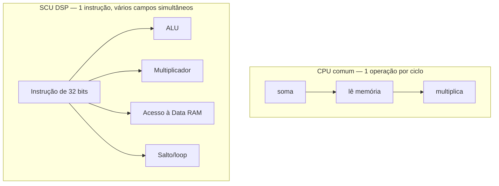

---

## 6. Quarto diagrama: troca de framebuffers VDP1/VDP2

**Pergunta:** solicitação do "quarto diagrama"; ao perguntar qual dos dois mecanismos pendentes o usuário queria (framebuffers ou ring buffer de som), a escolha foi **troca de framebuffers VDP1/VDP2**.

**Resposta:** enquanto o VDP1 termina de desenhar num buffer, o VDP2 exibe o outro, já pronto; no V-Blank os papéis se invertem instantaneamente. Isso evita *tearing*, porque a troca só ocorre durante o intervalo em que a tela não está sendo desenhada.

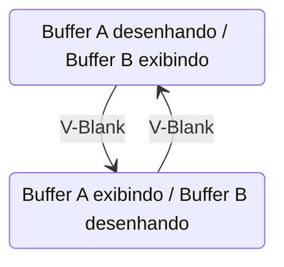

---

## 7. Último diagrama: ring buffer de som (SH-2 → SCSP)

**Pergunta:** "agora o último diagrama" — o mecanismo restante, o ring buffer de som.

**Resposta:** o SH-2 escreve comandos de áudio numa fila circular na Sound RAM; o 68000 lê esses comandos em ordem e repassa como ajustes de registrador para o SCSP, que sintetiza o som. A fila circular nunca precisa "acabar" — o ponteiro de escrita dá a volta, desde que não alcance o ponteiro de leitura (buffer cheio). É um desacoplamento clássico entre produtor e consumidor, cada um no seu ritmo.

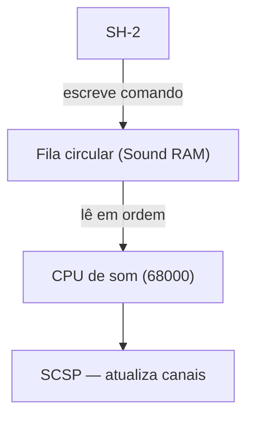

---

## 8. Arquitetura de atores/Mediator em Rust, comparada ao Saturn

**Pergunta:** a partir de um documento sobre atores isolados, Mediator central e buffers de memória compartilhada em Rust, pedido para desenhar como esses componentes (buffers, double buffering, ring buffer de som) poderiam ser implementados em Rust de forma equivalente ao Saturn.

**Resposta:** três diagramas — (1) Mediator roteando mensagens leves (`mpsc`/`oneshot`) para workers isolados, todos acessando um buffer compartilhado `Arc<RwLock<T>>` (leitura livre para todos, escrita exclusiva); (2) double buffering com `ArcSwap`, equivalente ao V-Blank do Saturn mas sem precisar de sinal de vídeo — a troca de ponteiro é atômica e não bloqueia leitores; (3) canal `mpsc` limitado funcionando como fila circular entre uma task produtora e uma consumidora, com a diferença de que o backpressure (fila cheia) é resolvido automaticamente pelo runtime do Tokio, em vez de controlado manualmente como no SH-2.

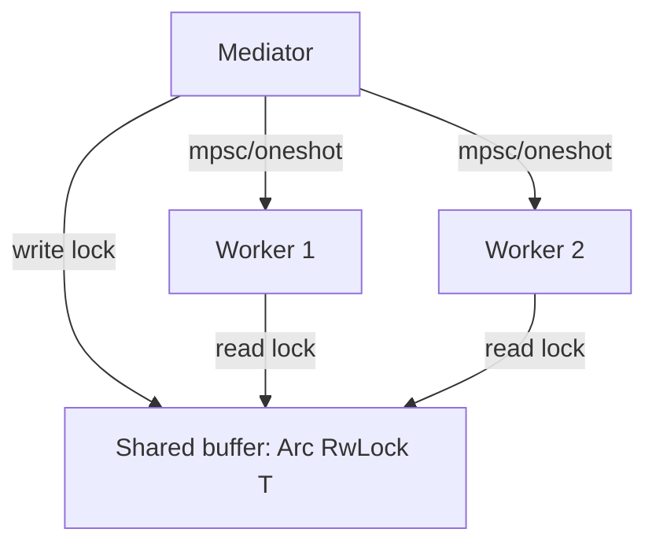

```mermaid
stateDiagram-v2
    R1: Buffer A escrevendo / Buffer B lendo
    R2: Buffer A lendo / Buffer B escrevendo
    R1 --> R2 : ArcSwap::store
    R2 --> R1 : ArcSwap::store
```

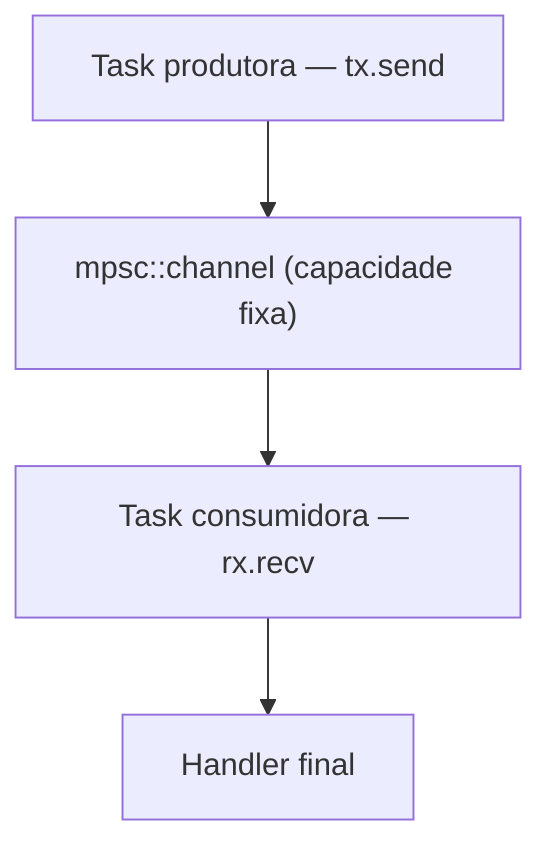

**Tabela de paralelo (Saturn ↔ Rust)** incluída na resposta original:

| Saturn | Rust (Tokio) |
|---|---|
| SCU como hub central | Mediator roteando mensagens |
| Registradores + DMA | `mpsc`/`oneshot` para comandos leves |
| VRAM compartilhada entre VDP1/VDP2 | `Arc<RwLock<T>>` ou `ArcSwap` |
| Toggle de framebuffer no V-Blank | Troca atômica de ponteiro (`ArcSwap::store`) |
| Ring buffer de som (SH-2 → SCSP) | Canal `mpsc` limitado como fila circular |

---

## 9. Subsistemas isolados com buffers dedicados

**Pergunta:** "sim faça essa segunda visão" — pedido do diagrama de múltiplos `Arc<RwLock<T>>` separados por subsistema (vídeo, som, lógica), análogo às memórias separadas do Saturn (VRAM, Sound RAM, Work RAM).

**Resposta:** cada subsistema (vídeo, som, lógica) tem seu próprio worker e seu próprio buffer isolado, em vez de um único `Arc<RwLock<T>>` compartilhado por tudo — assim uma escrita pesada na VRAM nunca bloqueia uma leitura no Sound RAM, porque os locks são completamente independentes.

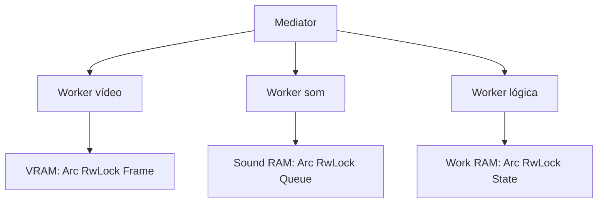

---

## 10. Plano de implementação do emulador em Rust — decisão sobre limpeza de buffers

**Pergunta:** pedido do plano completo para o Claude Code executar a construção do emulador do Saturn em Rust, usando a arquitetura discutida, com uma dúvida específica: deixar o jogo controlar a limpeza dos buffers, ou deixar os mecanismos automáticos do Rust decidirem isso.

**Resposta:** expliquei que são duas camadas diferentes — o `Drop`/RAII do Rust cuida só de alocação/desalocação de memória; a limpeza de *conteúdo* de um buffer emulado (ex.: VDP1 limpando o framebuffer, `resetSelector` do CD-ROM) precisa ser disparada exclusivamente pelos sinais que o próprio jogo manda para os registradores emulados, nunca por um mecanismo automático do Rust — porque os jogos dependem do timing exato do hardware real. Cada buffer deve expor métodos explícitos (`clear_on_vdp1_command()`, `reset_selector(id)`), chamados só quando a CPU emulada escreve no registrador correspondente.

Nessa primeira versão do plano eu também havia sugerido, por questão de precisão de ciclo, que o núcleo de emulação rodasse num laço single-thread — essa sugestão foi revisada no item 11, a pedido do usuário.

---

## 11. Revisão do plano: arquitetura distribuída de verdade nos 4 núcleos

**Pergunta:** o usuário rejeitou a sugestão de laço single-thread, apontando que é exatamente isso que compromete o desempenho do Yabause em handhelds com múltiplos núcleos fracos (ex.: R36S, ARM64 Cortex-A53 quad-core), e pediu que o plano realizasse literalmente a arquitetura distribuída desenhada na sessão, com o "DMA que pausa o barramento" implementado como um processo isolado de verdade.

**Resposta:** reescrevi o plano com cada bloco de hardware como uma thread dedicada, mapeada a um núcleo específico do R36S (Core 0: SH-2 mestre; Core 1: SH-2 escravo; Core 2: SCU + SMPC + CS2; Core 3: vídeo + áudio). O "DMA pausa o barramento" virou um `BusArbiter` real — um lock (`AtomicBool` + `Condvar`) que a SCU controla e que as threads do SH-2 checam e bloqueiam de fato ao tentar acessar o barramento durante uma transferência. Para evitar que os atores corram à frente uns dos outros e dessincronizem o timing, propus sincronização por barreira com folga limitada (*bounded-slack lockstep*): nenhum ator pode avançar mais que N ciclos além do mais atrasado sem passar por um ponto de checagem via canal. Deixei registrado como risco em aberto que multi-threading real reduz o determinismo bit-exato entre execuções (relevante só se save states/replay determinístico forem requisito).

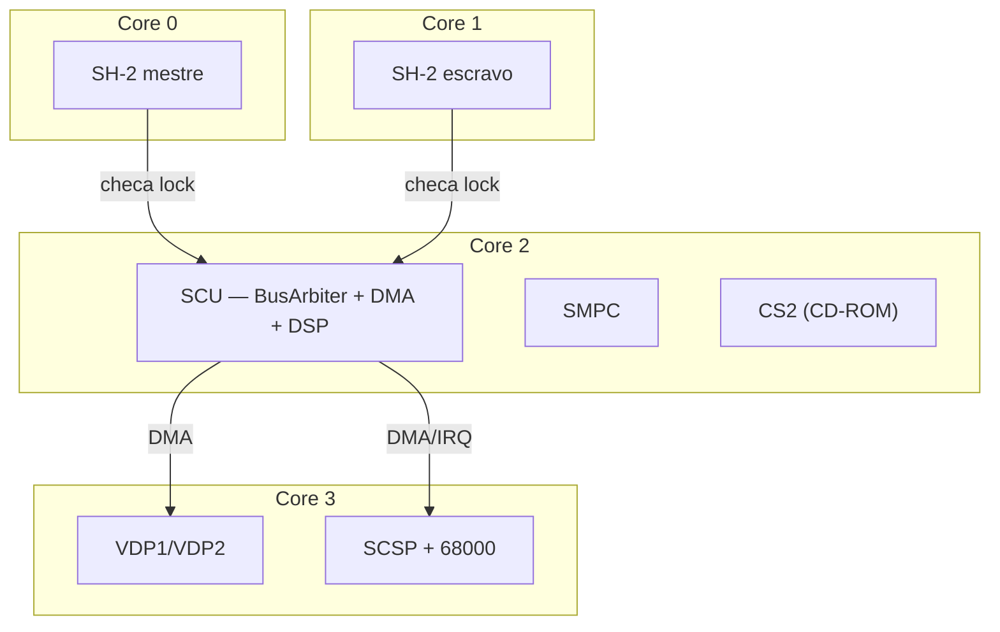

O plano completo (ambas as versões) foi entregue como arquivo separado: `plano_emulador_saturn_rust.md`.

---

## 12. Nome de uma lua de Saturno

**Pergunta:** pedido de um nome de lua de Saturno.

**Resposta:** **Titã** — a maior lua de Saturno e a única do sistema solar com atmosfera densa (mais densa que a da Terra, majoritariamente nitrogênio), com lagos de metano líquido na superfície; um dos poucos lugares além da Terra onde já pousou uma sonda (Huygens, 2005). Outras opções mencionadas: Encélado (gêiseres de gelo, oceano subterrâneo), Jápeto (hemisférios com cores muito diferentes) e Mimas (parecida com a Estrela da Morte).