# Session log: hardware architectures, Saturn, and emulation in Rust

This document gathers every question asked during the session, the context behind each one, my answers, and the diagrams that were generated — recreated here in static **Mermaid.js** instead of the animated SVG versions shown in the chat.

---

## 1. x86 architecture diagram: program → CPU → caches → memory/GPU

**Question:** a request for an animated diagram showing information leaving a program, passing through the CPU, being stored in L1/L2 cache, and talking to memory (via the FSB and DDR slots) and to the GPU (via FSB/PCI Express) — an illustration of x86 architecture, buses, and caches.

**Answer:** I explained the path: the program runs on the core (ALU); frequently-used data sits in L1 (small, very fast) and L2 (larger); when it's not in cache, it goes out over the Front Side Bus (FSB) to RAM (via DDR slots) or to the GPU (via PCI Express). I noted that this layout reflects the classic x86 architecture (2000s); in modern CPUs the FSB has been replaced by an integrated memory controller and direct interconnects (QPI/Infinity Fabric).

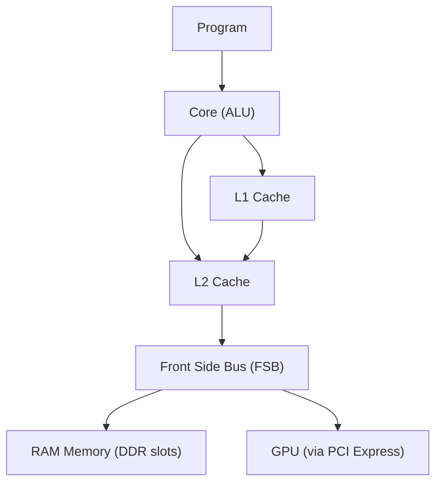

---

## 2. From game input to the frame on screen

**Question:** "create something more complete, from a game's input all the way to the frame showing up on screen."

**Answer:** I split it into two parts. Part 1 — the player's command goes from the peripheral to USB, the CPU processes the game logic (physics, AI, next state) and sends drawing commands to the GPU via PCI Express. Part 2 — inside the GPU, the vertex shader positions the vertices, rasterization converts triangles into pixels, the pixel shader computes the final color; the finished frame sits in the framebuffer (VRAM) and goes out over HDMI/DisplayPort to the monitor.

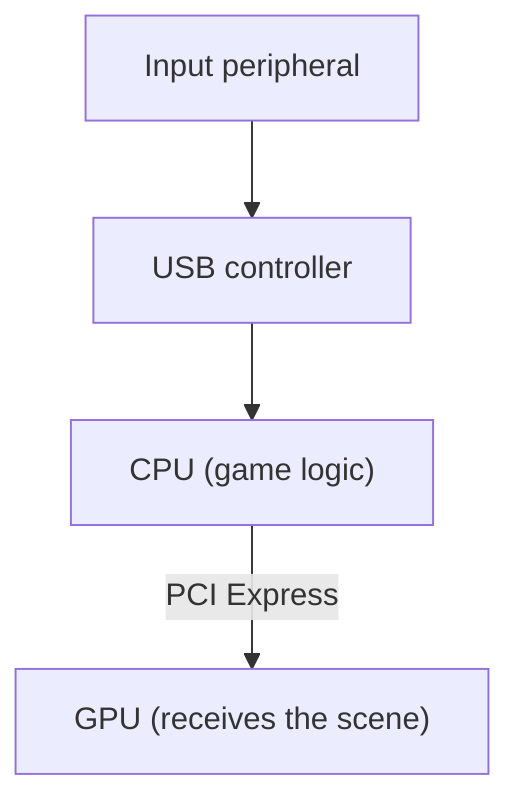

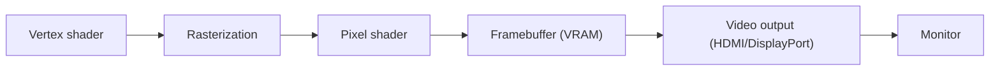

---

## 3. A physical tour of the hardware (motherboard, buses, and CPU vs. GPU caches)

**Question:** a request to see the "tour" of the physical hardware — CPU, GPU, DDR memory, disk, peripherals, monitor — with more detail on the FSB, GPU and CPU caches, PCI Express, and other buses.

**Answer:** I showed the physical map of how the components connect (RAM ↔ CPU via the DDR channel; CPU ↔ GPU via PCIe; CPU ↔ Chipset via DMI, the FSB's successor; Chipset ↔ Disk via SATA/NVMe; Chipset ↔ Peripherals via USB; GPU → Monitor via HDMI/DP). I then compared the cache hierarchies: the CPU has a few powerful cores with a tiny, very fast L1, a shared L2/L3, and RAM; the GPU has thousands of simple cores, an L1 cache per shader block, a shared L2, and dedicated VRAM for textures.

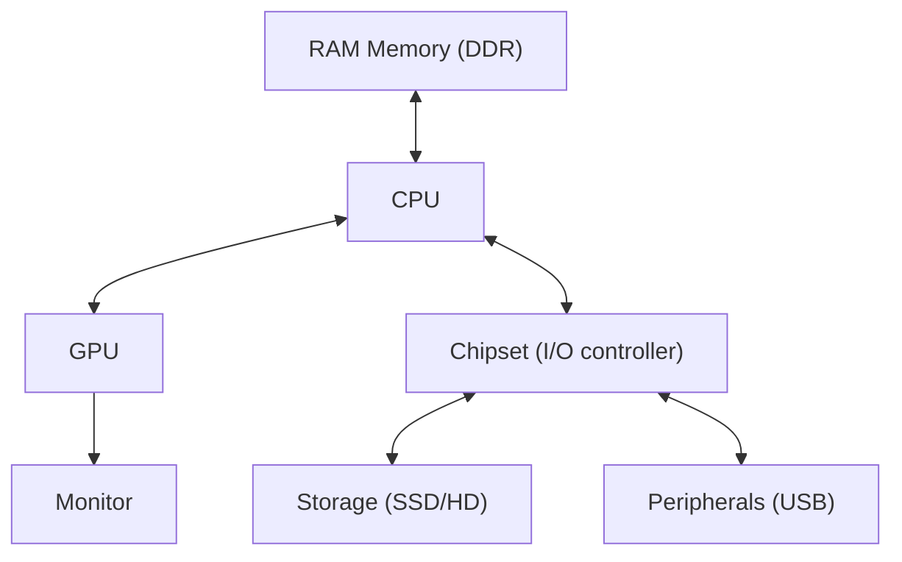

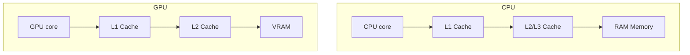

---

## 4. Sega Saturn architecture (based on the submitted report)

**Question:** a request to diagram the hardware structure described in `saturn_architecture_report.md`, including DMAs, VLIWs, registers, and buffers.

**Answer:** I split it into three diagrams. (1) General topology: the SCU as the central hub connecting the CPU block (Master/Slave SH-2), the video block (VDP1/VDP2), the sound block (68000/SCSP), and peripherals (SMPC/CS2). (2) Inside the SCU: three DMA channels with different priorities (level 0 woken by V-Blank for the VDP1, level 1 by H-Blank/CD-ROM, level 2 low priority) and the VLIW DSP with Program RAM (256 instructions) and Data RAM split into 4 blocks (MD0–MD3). (3) CD-ROM pipeline: CR1–CR4 registers and HIRQ, 24 sector filters/selectors, a partition buffer (up to 200 blocks), the DTR data port, and the final transfer via SCU DMA into Work RAM.

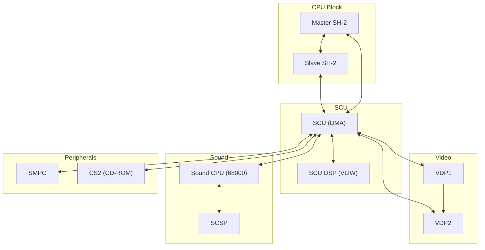

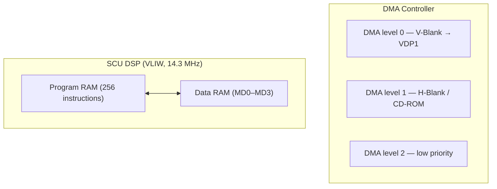

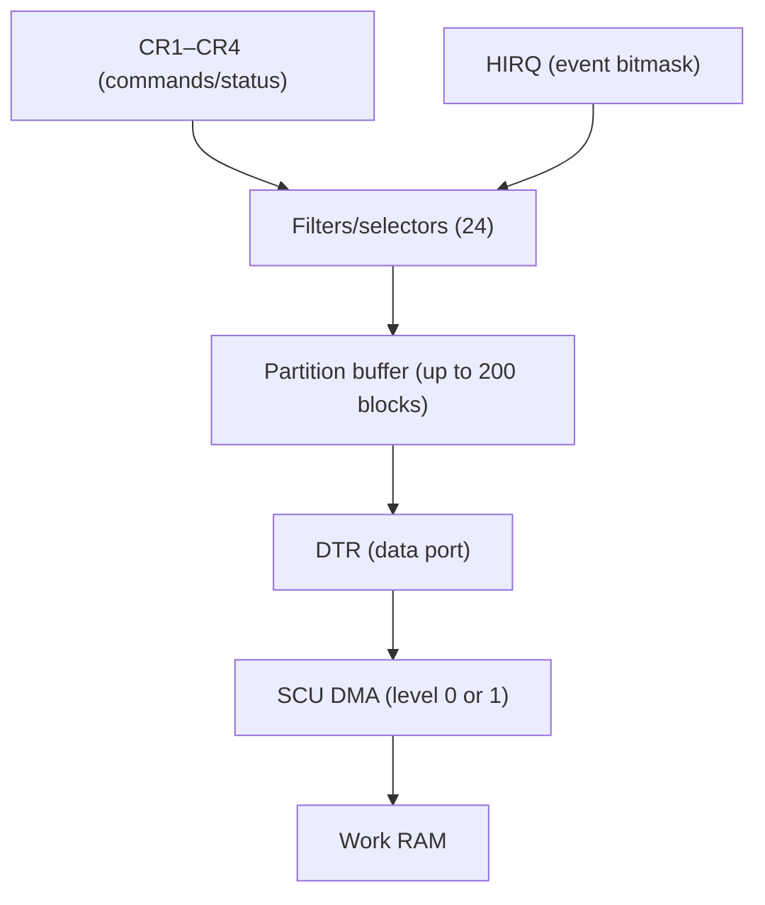

---

## 5. What the SCU DSP does and what VLIW is

**Question:** an explanation of what the SCU DSP does and the concept of VLIW.

**Answer:** the SCU DSP is an extra processor inside the SCU, dedicated to heavy calculations (3D transforms, physics, draw lists) without occupying the main SH-2 — it runs at 14.3 MHz, with a 256-instruction Program RAM and Data RAM split into 4 blocks, its own registers (`AC`, `P`, `RX`, `RY`), and instruction families for ALU operations, constant loading, and control (DMA, jumps, loops). VLIW (*Very Long Instruction Word*) means a single instruction is split into fields that control several hardware units **simultaneously**, decided ahead of time by whoever writes the code — unlike an ordinary CPU, which executes one operation at a time.

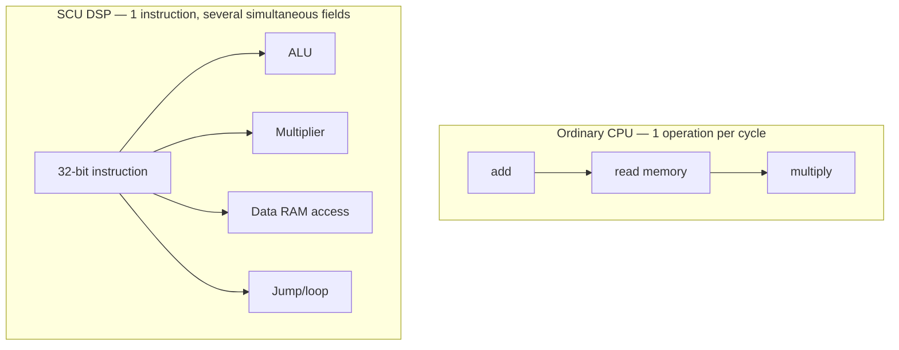

---

## 6. Fourth diagram: VDP1/VDP2 framebuffer swap

**Question:** a request for the "fourth diagram"; when asked which of the two remaining mechanisms the user wanted (framebuffers or the sound ring buffer), the choice was **VDP1/VDP2 framebuffer swap**.

**Answer:** while the VDP1 finishes drawing into one buffer, the VDP2 displays the other, already-ready one; at V-Blank the roles swap instantly. This avoids *tearing*, because the swap only happens during the interval when the screen isn't being drawn.

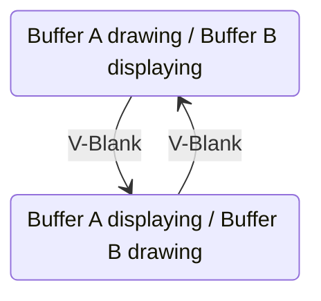

---

## 7. Last diagram: sound ring buffer (SH-2 → SCSP)

**Question:** "now the last diagram" — the remaining mechanism, the sound ring buffer.

**Answer:** the SH-2 writes audio commands into a circular queue in Sound RAM; the 68000 reads these commands in order and passes them on as register adjustments to the SCSP, which synthesizes the sound. The circular queue never needs to "end" — the write pointer wraps around, as long as it doesn't catch up to the read pointer (buffer full). It's a classic producer/consumer decoupling, each running at its own pace.

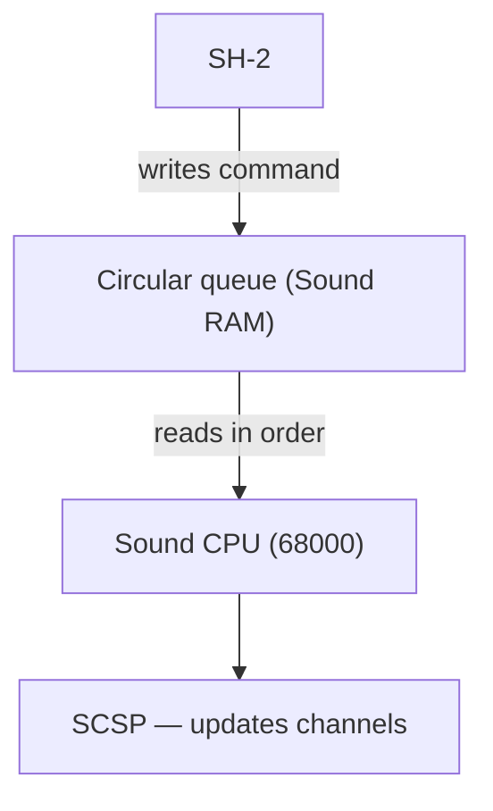

---

## 8. Actor/Mediator architecture in Rust, compared to the Saturn

**Question:** based on a document about isolated actors, a central Mediator, and shared-memory buffers in Rust, a request to diagram how these components (buffers, double buffering, sound ring buffer) could be implemented in Rust in a way equivalent to the Saturn.

**Answer:** three diagrams — (1) the Mediator routing lightweight messages (`mpsc`/`oneshot`) to isolated workers, all accessing a shared `Arc<RwLock<T>>` buffer (free reading for everyone, exclusive writing); (2) double buffering with `ArcSwap`, equivalent to the Saturn's V-Blank but without needing a video signal — the pointer swap is atomic and never blocks readers; (3) a bounded `mpsc` channel acting as a circular queue between a producer task and a consumer task, with the difference that backpressure (full queue) is resolved automatically by the Tokio runtime, instead of being manually controlled like on the SH-2.

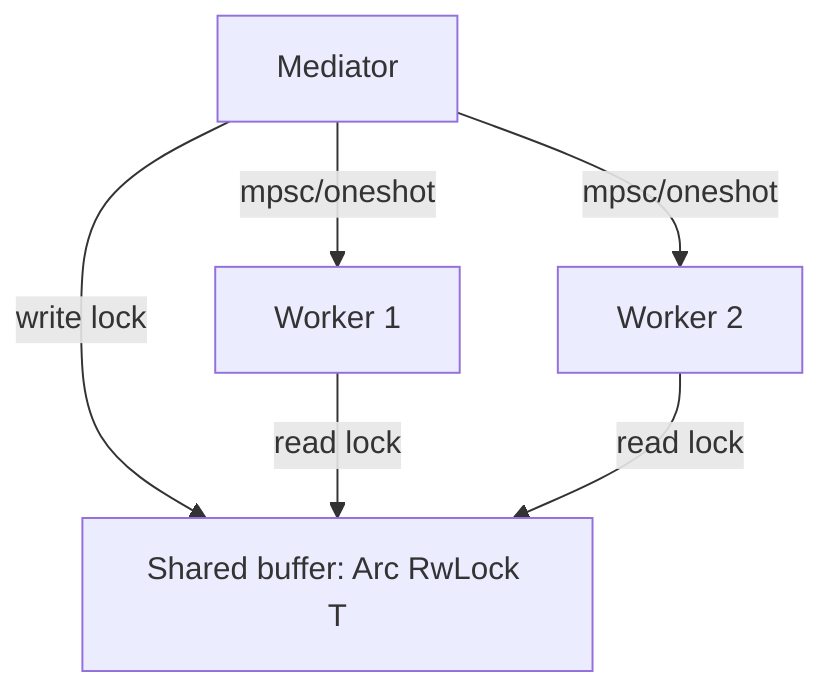

```mermaid
stateDiagram-v2
    R1: Buffer A writing / Buffer B reading
    R2: Buffer A reading / Buffer B writing
    R1 --> R2 : ArcSwap::store
    R2 --> R1 : ArcSwap::store
```

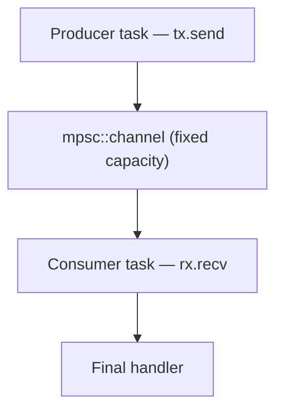

**Parallel table (Saturn ↔ Rust)** included in the original answer:

| Saturn | Rust (Tokio) |
|---|---|
| SCU as the central hub | Mediator routing messages |
| Registers + DMA | `mpsc`/`oneshot` for lightweight commands |
| VRAM shared between VDP1/VDP2 | `Arc<RwLock<T>>` or `ArcSwap` |
| Framebuffer toggle at V-Blank | Atomic pointer swap (`ArcSwap::store`) |
| Sound ring buffer (SH-2 → SCSP) | Bounded `mpsc` channel as a circular queue |

---

## 9. Isolated subsystems with dedicated buffers

**Question:** "yes, do that second view" — a request for a diagram of multiple `Arc<RwLock<T>>` instances separated by subsystem (video, sound, logic), analogous to the Saturn's separate memories (VRAM, Sound RAM, Work RAM).

**Answer:** each subsystem (video, sound, logic) has its own worker and its own isolated buffer, instead of a single `Arc<RwLock<T>>` shared by everything — that way a heavy write to VRAM never blocks a read from Sound RAM, because the locks are completely independent.


---

## 10. Rust emulator implementation plan — decision on buffer clearing

**Question:** a request for the complete plan for Claude Code to carry out building the Saturn emulator in Rust, using the architecture discussed, with one specific question: should the game control clearing the buffers, or should Rust's automatic mechanisms decide that.

**Answer:** I explained these are two different layers — Rust's `Drop`/RAII only handles memory allocation/deallocation; clearing the *contents* of an emulated buffer (e.g. VDP1 clearing the framebuffer, the CD-ROM's `resetSelector`) must be triggered exclusively by the signals the game itself sends to the emulated registers, never by an automatic Rust mechanism — because games depend on the real hardware's exact timing. Each buffer should expose explicit methods (`clear_on_vdp1_command()`, `reset_selector(id)`), called only when the emulated CPU writes to the corresponding register.

In this first version of the plan I had also suggested, for cycle-accuracy reasons, that the emulation core run in a single-thread loop — that suggestion was revised in item 11, at the user's request.

---

## 11. Plan revision: a genuinely distributed architecture across the 4 cores

**Question:** the user rejected the single-thread loop suggestion, pointing out that this is exactly what hurts Yabause's performance on handhelds with multiple weak cores (e.g. the R36S, a quad-core ARM64 Cortex-A53), and asked that the plan literally carry out the distributed architecture drawn up during the session, with the "DMA that pauses the bus" implemented as a genuinely isolated process.

**Answer:** I rewrote the plan with each hardware block as a dedicated thread, mapped to a specific R36S core (Core 0: Master SH-2; Core 1: Slave SH-2; Core 2: SCU + SMPC + CS2; Core 3: video + audio). "DMA pauses the bus" became a real `BusArbiter` — a lock (`AtomicBool` + `Condvar`) that the SCU controls and that the SH-2 threads check and genuinely block on when trying to access the bus during a transfer. To keep the actors from running ahead of each other and desyncing the timing, I proposed bounded-slack lockstep synchronization: no actor may advance more than N cycles past the slowest one without passing through a checkpoint over a channel. I noted as an open risk that real multi-threading reduces bit-exact determinism across runs (only relevant if save states/deterministic replay are a requirement).

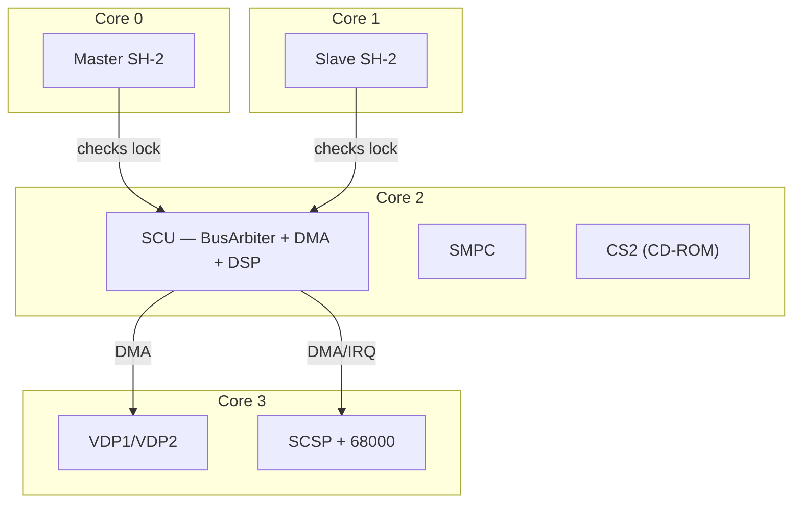

The full plan (both versions) was delivered as a separate file: `plano_emulador_saturn_rust.md`.

---

## 12. The name of a moon of Saturn

**Question:** a request for the name of a moon of Saturn.

**Answer:** **Titan** — Saturn's largest moon, and the only one in the solar system with a dense atmosphere (denser than Earth's, mostly nitrogen), with lakes of liquid methane on its surface; one of the few places beyond Earth a probe has ever landed on (Huygens, 2005). Other options mentioned: Enceladus (ice geysers, subsurface ocean), Iapetus (hemispheres with very different colors), and Mimas (which looks like the Death Star).
