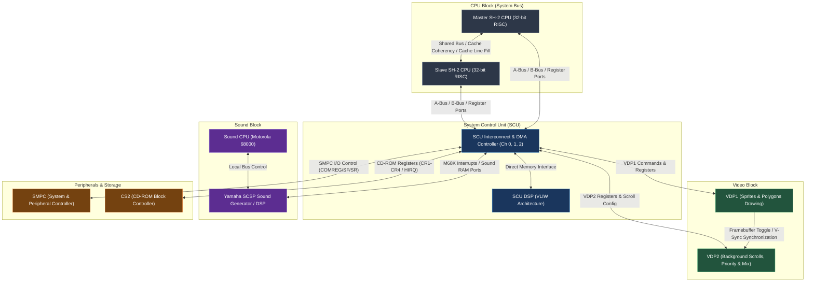

# Saturn Hardware Architecture: Complete Technical Report
*Based on Yabause & YabaSanshiro Emulator Implementation*

---

## 1. System Overview & Processor Communication Topology

The Sega Saturn is a multi-processor console utilizing a shared system bus, dedicated local memory buses, and specialized coprocessors. Below is the Mermaid diagram illustrating the communication topology, registers, and synchronization mechanisms between the components.

---

## 2. Processor Architecture & Command/Opcode Sets

### 2.1 Hitachi SH-2 (Dual 32-bit RISC CPU)
The SH-2 processors serve as the main console CPUs. The Master and Slave SH-2 execute standard Hitachi SH-2 RISC instruction opcodes (16-bit instruction length, load/store architecture, 16 general-purpose registers `R0`–`R15`).

* **Interaction & Synchronization:**
  * **Inter-CPU Interrupts:** One CPU triggers an interrupt on the other using custom register writes (handled via the SCU interrupt controller, vector levels 0-15).
  * **Slave CPU control:** The Master SH-2 starts and stops the Slave CPU via the SMPC command register (commands `SSHON` / `SSHOFF`).
  * **Bus Arbitration:** Controlled by the system bus arbiter. Both SH-2s share the main work RAM (divided into two regions: low-speed and high-speed page-mode access regions).
  * **Cache Coherency:** Software-controlled. A 4-way set-associative 4KB cache is present on each SH-2. Developers must manually invalidate or bypass cache lines (via the cache control register at `0xFFFFFE92` or writing to address range `0x60000000`–`0x7FFFFFFF` for cache-through space) to prevent stale reads when both CPUs access shared buffers.

---

### 2.2 SCU DSP (System Control Unit Digital Signal Processor)
The SCU DSP is an independent VLIW (Very Long Instruction Word) processing core running at 14.3 MHz. It operates on 32-bit instructions stored in Program RAM (256 instruction limit) and accesses Data RAM (organized as 4 memory blocks of 64 words each: `MD0`–`MD3`).

#### SCU DSP Instructions & Opcodes
SCU DSP instructions are decoded by their top bits:
* **ALU Commands (`instruction >> 26`):**
  * `0x00`: **NOP** - No Operation.
  * `0x01`: **AND** - Bitwise AND between Accumulator (`AC`) and Product Register (`P`).
  * `0x02`: **OR** - Bitwise OR between `AC` and `P`.
  * `0x03`: **XOR** - Bitwise XOR between `AC` and `P`.
  * `0x04`: **ADD** - Add `AC` and `P` (updates Z, S, C flags).
  * `0x05`: **SUB** - Subtract `P` from `AC` (updates Z, S, C flags).
  * `0x06`: **AD2** - Add `AC` and `P` using full 48-bit sign-extended precision.
  * `0x08`: **SR** - Arithmetic Shift Right of `AC` by 1 bit (fills carry flag `C` with LSB).
  * `0x09`: **RR** - Rotate Right of `AC` through carry flag `C`.
  * `0x0A`: **SL** - Logical Shift Left of `AC` by 1 bit.
  * `0x0B`: **RL** - Rotate Left of `AC` through carry flag `C`.
  * `0x0F`: **RL8** - Rotate Left of `AC` by 8 bits.

* **Operation Types (`instruction >> 30`):**
  * `0x00`: **Operation Commands** - Moves data on parallel internal buses (X-Bus, Y-Bus, D1-Bus).
    * Can multiply registers `RX` * `RY` into Product register `P` (via `MOV MUL, P`).
    * Reads from general source selectors (`readgensrc`).
    * Direct data movement into destinations (`writed1busdest`).
  * `0x02`: **Load Immediate Commands** - Loads constants into DSP internal registers:
    * `MVI Imm, [d]` - Loads a 25-bit immediate value into target destination `d` (e.g. `RX`, `RY`, `RA0`, `WA0`, `LOP`, `TOP`, `CT0`-`CT3`).
    * Conditional variants (e.g. `MVI NZ`, `MVI NS`, `MVI NC`, `MVI NT0`, `MVI Z`, `MVI S`, `MVI C`, `MVI T0`).
  * `0x03`: **Control and I/O Commands**:
    * **DMA Operations** (`((instruction >> 28) & 0xF) == 0x0C`): Transfers data between system memory (RAM/VRAM) and internal Data RAM blocks (`MD0`–`MD3`). Initiated by specifying source address, destination address, and transfer counter.
    * **Jump Commands** (`((instruction >> 28) & 0xF) == 0x0D`): Conditional or unconditional jumps to target instruction program address (e.g., `JMP`, `JMP Z`, `JMP NZ`, `JMP S`, `JMP NS`, `JMP C`, `JMP NC`, `JMP T0`).
    * **Loop Instructions** (`((instruction >> 28) & 0xF) == 0x0E`):
      * `LPS` - Loop start/decrement control using `LOP` register.
      * `BTM` - Loop back to top address stored in `TOP` register.
    * **Program Terminate** (`((instruction >> 28) & 0xF) == 0x0F`):
      * `END` - Ends DSP execution.
      * `ENDI` - Ends DSP execution and generates an interrupt signal to the Master SH-2.

---

### 2.3 Yamaha SCSP DSP (Sound Digital Signal Processor)
The SCSP DSP is a VLIW processor inside the sound generator chip, designed for real-time digital audio mixing and effects processing (reverb, delay, etc.). It operates concurrently with the Motorola 68000 sound CPU.

* **VLIW Instruction Format (64-bit instruction word split across registers):**
  * It does not parse opcodes in a traditional sense. Instead, each bit field in the 64-bit instruction directly enables or controls hardware modules:
    * `tra` (Temporary Register Address), `twt` (Temporary Write Toggle), `twa` (Temporary Write Address).
    * `xsel` / `ysel` (Multiply-Accumulate input bus selectors).
    * `ira` (Input Register Address), `iwt` (Input Write Toggle), `iwa` (Input Write Address).
    * `table` (Lookup Table selection), `mwt` / `mrd` (Memory Write/Read control signals).
    * `ewt` / `ewa` (Envelope Write Toggle and Address).
    * `adrl` / `frcl` (Integer/Fractional Address Modulation selectors).
    * `shift` (Bit shifter mode - shift output accumulator by 1, 2, or 3 bits).
    * `yrl` (Y Register Load), `negb` (Negate B-input), `zero` (Zero out accumulator).
    * `coef` (Coefficient multiplier address).
    * `masa` (Memory Address Source Selection).
    * `adreb` (Address relative base selection), `nxadr` (Next address controller).

---

## 3. Peripheral Controllers & Hardware Protocols

### 3.1 System Manager and Peripheral Control (SMPC)
The SMPC acts as the console's microcontroller (using an internal 4-bit controller) handling power sequencing, region lockouts, system clock modes, reset buttons, and serial peripheral communication (controllers, analog sticks, multitaps, etc.).

#### SMPC Registers (Mapped at `0x20100000` onwards)
* `IREG` (Input Registers 0-6): Parameters passed from main CPU.
* `OREG` (Output Registers 0-31): Results returned to main CPU.
* `COMREG` (Command Register): Target command byte to execute.
* `SR` (Status Register): Reports SMPC execution status.
* `SF` (Status Flag): Synchronization semaphore. Writing a command sets SF to 1. The SMPC clears SF to 0 once execution completes.

#### SMPC Commands (`COMREG` values)
* `0x00`: **MSHON** - Master SH-2 Power On.
* `0x02`: **SSHON** - Slave SH-2 Power On.
* `0x03`: **SSHOFF** - Slave SH-2 Power Off (resets Slave state).
* `0x06`: **SNDON** - Sound CPU (M68K) On.
* `0x07`: **SNDOFF** - Sound CPU (M68K) Off.
* `0x08`: **CDON** - CD-ROM Controller Block On.
* `0x09`: **CDOFF** - CD-ROM Controller Block Off.
* `0x0D`: **SYSRES** - Complete System Reset (reboots console).
* `0x0E`: **CKCHG352** - Switch system master clock output mode to 352-dots/line (28.6 MHz).
* `0x0F`: **CKCHG320** - Switch system master clock output mode to 320-dots/line (26.8 MHz).
* `0x10`: **INTBACK** - Interrupt Back. Queries internal SMPC configuration, RTC (Real-Time Clock) state, and serial controller data. Runs in two phases: Status phase followed by Peripheral Query phase.
* `0x17`: **SETSMEM** - Set System Non-volatile Memory (saves backup RAM parameters).
* `0x18`: **NMIREQ** - Triggers a Non-Maskable Interrupt on the Master SH-2.
* `0x19`: **RESENAB** - Enable the console's physical Reset Button.
* `0x1A`: **RESDISA** - Disable the console's physical Reset Button.

---

### 3.2 CS2 (CD-ROM Subsystem Block)
The Saturn CD-ROM subsystem acts as an autonomous processor block containing its own microcontroller, CD DSP, CD buffer controller, and 512KB of sector buffer RAM.

#### Registers (Mapped to A-Bus at `0x25890000` range)
* `CR1` / `CR2` / `CR3` / `CR4`: Command registers (writes from CPU trigger commands; read values contain returns/status).
* `HIRQ` (Hardware Interrupt Request): Bitmask reporting events (e.g., Command OK, Data Transfer Ready, Disk Change).
* `HIRQMASK`: Controls which `HIRQ` status updates trigger physical A-Bus interrupts on the main SH-2 CPUs.
* `DTR` (Data Transfer Register): Port where sectors are read/written during DMA operations.

#### CD-ROM Commands (`CR1 >> 8` instruction byte)
* `0x00`: **getStatus** - Returns current drive status (playing, seeking, tray open, etc.).
* `0x01`: **getHardwareInfo** - Returns system flags, region limits, and MPEG card presence.
* `0x02`: **getToc** - Returns Table of Contents of loaded disc.
* `0x03`: **getSessionInfo** - Returns multi-session layout details.
* `0x04`: **initializeCDSystem** - Warm reset of the CD controller and buffers.
* `0x05`: **OpenTray** - Opens physical disc tray.
* `0x06`: **endDataTransfer** - Terminates active buffer-to-system DMA transfers.
* `0x10`: **playDisc** - Starts CD audio or data playback at a target FAD (Frame Address).
* `0x11`: **seekDisc** - Positions pickup lens to targeted FAD.
* `0x12`: **ScanDisc** - Scans forward or backward on the CD track.
* `0x20`: **getSubcodeQRW** - Reads current subcode frame information.
* `0x22`: **setCDDeviceConnection** - Configures the routing of CD sector outputs to filters or MPEG processors.
* `0x24`: **getLastBufferDestination** - Returns partition index of the last processed data block.
* `0x30`: **setFilterRange** - Binds a sector filter to select specific ranges on disc.
* `0x31`: **setFilterSubheaderConditions** - Filters sectors matching specific CD-ROM XA Subheader metadata.
* `0x32`: **setFilterMode** - Configures destination routing (Buffer memory vs CD Audio mixer).
* `0x33`: **setFilterConnection** - Binds filter outputs to specific Buffer Partition selectors.
* `0x35`: **resetSelector** - Resets sector router selectors and flushes matching buffers.
* `0x37`: **getSectorNumber** - Reports count of cached sectors matching a selector.
* `0x38`: **calculateActualSize** - Measures block count size inside a selector partition.
* `0x40`: **getSectorInfo** - Queries file system parameters of sectors in memory.
* `0x42`: **executeFadSearch** - Scans buffer for a specific Frame Address index.
* `0x44`: **setSectorLength** - Sets data block size (2048, 2336, 2340, or 2352 bytes).
* `0x60`: **getSectorData** - Initiates transfer of buffered sectors to system memory (read via `DTR`).
* `0x61`: **deleteSectorData** - Frees up cache memory in specified buffer partition.
* `0x70`: **changeDirectory** - Modifies relative directory location for ISO9660 parsing.
* `0x71`: **readDirectory** - Initiates directory table search.
* `0x74`: **readFile** - Reads files directly from the disc matching ISO9660 filenames.
* `0xE0`: **authenticateDevice** - Runs Saturn security ring verification on game media.

---

## 4. Hardware Synchronizations & Data Buffering

1. **CD-ROM Buffer & Filter Pipeline:**
   The CD-ROM subsystem contains 24 configurable **Selectors/Filters** and a **Partition Buffer** (holding up to 200 blocks of sector data). When a sector is read from the disc, the CD controller matches its headers against active filters. If successful, the sector is buffered into the linked partition automatically. The Master SH-2 is notified via the `HIRQ` register (bit `DRDY` set). The CPU then triggers a Level 0 or 1 SCU DMA transfer to copy the data from `DTR` into system Work RAM.

2. **SCU DMA - Processor Interaction:**
   The System Control Unit manages three DMA levels (Level 0, 1, and 2). Level 0 is the highest priority and is triggered by V-Blank interrupts (frequently used to stream polygon lists into VDP1 VRAM). Level 1 is medium priority (triggered by H-Blank or CD-ROM transfers). Level 2 is low priority. If a CPU write activates DMA, the SCU halts the SH-2 system bus, reads from source space (e.g., Work RAM), and outputs directly to destination space (e.g., VRAM) without CPU overhead.

3. **VDP1 Framebuffer Toggle:**
   The VDP1 draws sprites and polygons into one of two active framebuffers in VRAM. It operates asynchronously. Once VDP1 completes its drawing list, it signals the VDP2. During the next V-Blank interval, the framebuffers are swapped: VDP2 displays the newly drawn buffer, and VDP1 begins clearing the other buffer for the next frame. The status register flags this synchronization to prevent screen tearing.

4. **Sound Subsystem Ring Buffer:**
   The M68K CPU manages sample playback, envelope progression, and SCSP DSP instruction tables. Communication between the main SH-2 CPUs and the Sound RAM/SCSP registers is done via a dedicated Sound RAM window (`0x25B00000` onwards). Typically, the SH-2 posts playback commands into a circular queue (ring buffer) inside Sound RAM, and the M68K pulls commands out, updating SCSP channel registers sequentially.
